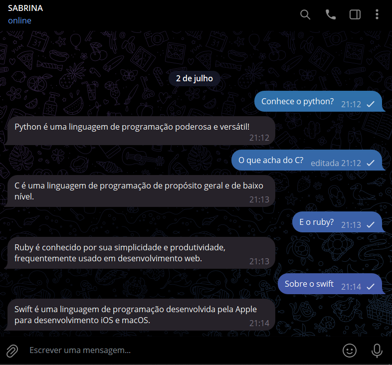

# CONVERSADOR COM PYROGRAM
🤤ESSE É UM BOT DO TELEGRAM FEITO COM PYROGRAM QUE RESPONDE COM INFORMAÇÕES RELEVANTES CONFORME AS PALAVRAS-CHAVE SÃO DETECTADAS NAS MENSAGENS RECEBIDAS!

 <br>

## DESCRIÇÃO:
O bot implementado utiliza a biblioteca Pyrogram para criar um bot de conversa no Telegram. Ele é projetado para responder a mensagens privadas com informações sobre linguagens de programação específicas, baseadas em palavras-chave detectadas nas mensagens recebidas. Se nenhuma palavra-chave correspondente for encontrada, o bot envia uma mensagem padrão indicando que não entendeu a mensagem.

## FUNCIONALIDADES:
1. **Respostas Baseadas em Palavras-Chave**: O bot reconhece palavras-chave como "python", "java", "javascript", entre outras, e envia uma resposta específica sobre cada linguagem de programação.

2. **Mensagem Padrão de Resposta**: Se a mensagem não contiver nenhuma palavra-chave reconhecida, o bot responde com "EU NÃO ENTENDO QUE DIZES".

3. **Configuração Fácil**: Utiliza uma sessão salva ("my_account.session") para autenticar o cliente Pyrogram, simplificando a configuração e o uso do bot.

## EXECUTANDO O PROJETO:
1. **Autorização do usuário:**
   - Para usar a API, o Telegram requer que os usuários sejam autorizados por meio de seus números de telefone. Para fazer isso, siga as instruções do Telegram em [https://core.telegram.org/api/obtaining_api_id](https://core.telegram.org/api/obtaining_api_id) e certifique-se de entender e cumprir as regras para clientes e bibliotecas de terceiros explicadas lá. A chave da API consiste em duas partes: `api_id` e `api_hash`. Mantenha-a secreta. [SAIBA MAIS.](https://docs.pyrogram.org/start/setup)
   - Após autorizar-se com sucesso, um novo arquivo chamado `my_account.session` será criado permitindo que o Pyrogram execute chamadas de API com sua identidade. Este arquivo é pessoal e será carregado novamente quando você reiniciar seu aplicativo. [SAIBA MAIS.](https://docs.pyrogram.org/start/auth)

2. **Instalando as dependências:**
   - Antes de executar o bot, certifique-se de instalar todas as dependências necessárias. No terminal, execute o seguinte comando para instalar as dependências listadas no arquivo `requirements.txt` em `CODIGO`:
   ```bash
   pip install -r requirements.txt
   ```

3. **Inicie o Bot:**
   - Execute o bot do Telegram iniciando-o com o seguinte comando:
    ```bash
    python CODIGO.py
    ```

4. **Interagindo com o Bot**:
   - Envie mensagens privadas para o bot no Telegram contendo palavras-chave como "python", "java", "javascript", entre outras linguagens de programação. O bot responderá com informações básicas sobre cada uma delas ou com "EU NÃO ENTENDO QUE DIZES" se a mensagem não contiver nenhuma palavra-chave reconhecida.

## NÃO SABE?
- Entendemos que para manipular arquivos em muitas linguagens e tecnologias relacionadas, é necessário possuir conhecimento nessas áreas. Para auxiliar nesse aprendizado, oferecemos cursos gratuitos disponíveis:
* [CURSO DE PYROGRAM](https://github.com/VILHALVA/CURSO-DE-PYROGRAM)
* [CURSO DE PYTHON](https://github.com/VILHALVA/CURSO-DE-PYTHON)
* [CONFIRA MAIS CURSOS](https://github.com/VILHALVA?tab=repositories&q=+topic:CURSO)

## CREDITOS:
- [PROJETO CRIADO PELO VILHALVA](https://github.com/VILHALVA)

